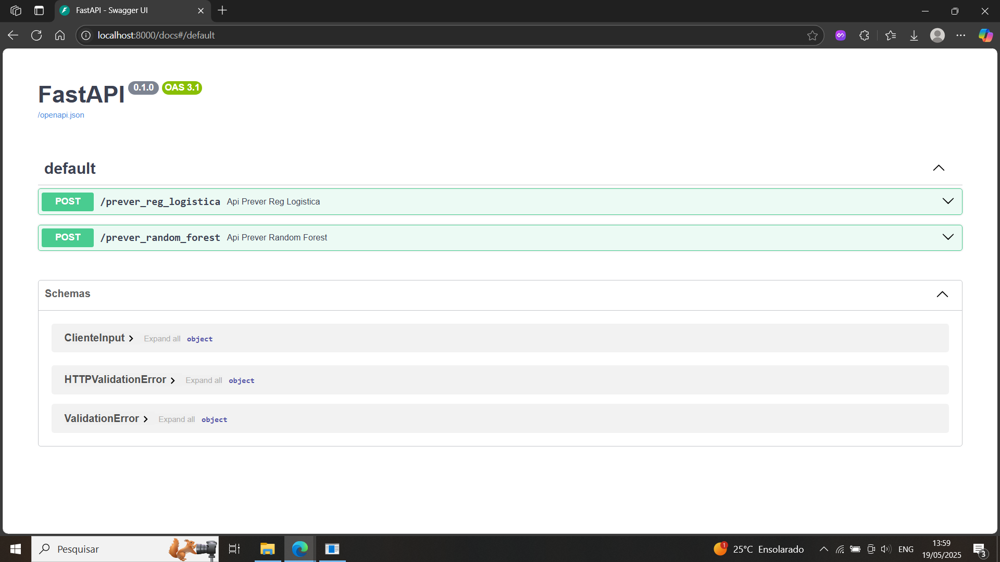
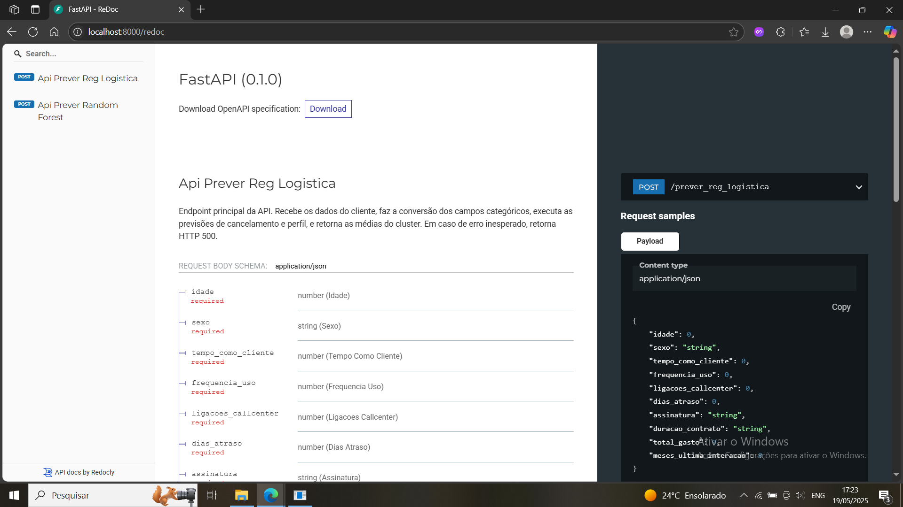

# Churn Predict API
---
## Visão Geral

Este projeto é uma API para previsão de cancelamento de clientes (churn) e análise de perfil, utilizando os modelos de Regressão Logística e Random Forest.

---

## Screenshot




---

## Como rodar

1. **Clone o repositório e instale as dependências:**
    ```bash
    pip install -r requirements.txt
    ```

2. **Treine os modelos (opcional, se já existirem os arquivos `.pkl` em `/model`):**
    ```bash
    python app/train.py
    ```

3. **Inicie a API:**
    ```bash
    uvicorn app.main:app --reload
    ```

4. **Acesse a documentação interativa:**
    [http://localhost:8000/docs](http://localhost:8000/docs)

## Exemplo de uso

Faça uma requisição POST para `/prever` com o seguinte JSON:

```json
{
  "idade": 30,
  "sexo": "Female",
  "tempo_como_cliente": 39,
  "frequencia_uso": 14,
  "ligacoes_callcenter": 5,
  "dias_atraso": 18,
  "assinatura": "Standard",
  "duracao_contrato": "Annual",
  "total_gasto": 932,
  "meses_ultima_interacao": 17
}
```

## Estrutura do Projeto

```
churn-predict/
│
├── app/
│   ├── main.py
│   ├── model.py
│   └── train.py
├── model/
│   ├── modelo_regressao_logistica.pkl
|   ├── modelo_random_forest.pkl
│   ├── scaler.pkl
│   ├── kmeans.pkl
│   └── cluster_stats.pkl
├── data/
│   └── cancelamentos.csv
├── requirements.txt
└── README.md
└── docs/
    └── swagger.png
    └── redoc.png
```
## Como obter os dados

O arquivo de dados `cancelamentos.csv` **não está neste repositório** devido ao seu tamanho.  
Para rodar o projeto, siga os passos abaixo para baixar o dataset original do Kaggle:

1. Acesse o link do dataset:  
   [https://www.kaggle.com/datasets/adrianosantosdev/dados-de-cancelamento-de-contrato-do-cliente](https://www.kaggle.com/datasets/adrianosantosdev/dados-de-cancelamento-de-contrato-do-cliente)
2. Baixe o arquivo `cancelamentos.csv` e coloque-o na pasta `data/` do projeto.


## Observações

- Os modelos são treinados a partir do arquivo `data/cancelamentos.csv`.
- Os arquivos `.pkl` são salvos na pasta `model/`.
- Para produção, configure variáveis de ambiente e segurança conforme necessário.

---

## Como funciona o pipeline de dados e análise

### 1. Leitura e preparação dos dados
- O arquivo `cancelamentos.csv` é carregado e a coluna `CustomerID` é removida, pois não é útil para previsão.
- Linhas com valores ausentes são descartadas para garantir a qualidade dos dados.

### 2. Transformação de variáveis categóricas
- As colunas `sexo`, `assinatura` e `duracao_contrato` são convertidas de texto para números usando o `LabelEncoder`.  
  Isso é necessário porque foram utilizados modelos de machine learning.

### 3. Normalização dos dados
- As colunas numéricas (como idade, tempo como cliente, total gasto, etc.) são normalizadas com o `StandardScaler`.  
  Isso faz com que todas fiquem na mesma escala, evitando que variáveis com valores maiores dominem o modelo.

### 4. Divisão em treino e teste
- Os dados são divididos em duas partes:  
  - **Treino:** para o modelo aprender.
  - **Teste:** para avaliar se o modelo aprendeu de verdade ou só decorou os dados.

### 5. Treinamento dos modelos
- Um modelo de **Regressão Logística** é treinado para prever se o cliente vai cancelar ou não.
- Um modelo de **Random Forest** também é treinado para a mesma tarefa, permitindo comparar um modelo linear (Regressão Logística) com um modelo mais robusto e não-linear (Random Forest).
- O desempenho de ambos os modelos é avaliado usando métricas como acurácia, precisão, recall, f1-score e matriz de confusão.

### 6. Clusterização (KMeans)
- O algoritmo KMeans agrupa os clientes em 8 perfis (clusters) com características semelhantes.
- Para cada cluster, são calculadas as médias das variáveis, ajudando a entender o perfil típico de cada grupo.
- Um gráfico mostra a distribuição de cancelamentos em cada cluster.
---

## Outras observações importantes

- **Pipeline seguro:** O pré-processamento (normalização, encoding) é feito corretamente apenas nos dados de treino antes de ser aplicado nos dados de teste, evitando vazamento de dados.
- **Reprodutibilidade:** O uso de `random_state` garante que os resultados sejam reproduzíveis.
- **Salvamento dos modelos:** Tanto o modelo de regressão logística quanto o Random Forest, além do scaler e do KMeans, são salvos em arquivos `.pkl` para uso posterior na API.
- **API flexível:** A API permite escolher qual modelo usar para previsão, facilitando experimentação e comparação de resultados.

---

### 7. Análise exploratória dos dados
- São gerados gráficos e tabelas para entender melhor os dados, como:
  - Proporção de cancelamentos.
  - Correlação entre variáveis.
  - Relação entre variáveis e a taxa de cancelamento.

---

## Principais observações analíticas

### Regressão Logística 

- **Acurácia:** 0.85
- **Relatório de Classificação:**
    - Precisão (classe 0): 0.81
    - Recall (classe 0): 0.85
    - F1-score (classe 0): 0.83
    - Precisão (classe 1): 0.88
    - Recall (classe 1): 0.85
    - F1-score (classe 1): 0.87
- **Matriz de Confusão:**
    ```
    [[64676 11598]
     [14819 85239]]
    ```
- **Observação:**  
  O modelo de regressão logística apresenta desempenho equilibrado entre as classes, com boa capacidade de generalização.

---

### Random Forest

- **Acurácia:** 0.99
- **Relatório de Classificação:**
    - Precisão (classe 0): 1.00
    - Recall (classe 0): 1.00
    - F1-score (classe 0): 1.00
    - Precisão (classe 1): 1.00
    - Recall (classe 1): 1.00
    - F1-score (classe 1): 1.00
- **Matriz de Confusão:**
    ```
    [[76274     0]
     [    2 100056]]
    ```
- **Observação Importante:**  
  O Random Forest atingiu acurácia quase perfeita no conjunto de teste. Isso pode indicar que o modelo está capturando padrões complexos, mas também pode ser um sinal de overfitting.  
  Recomenda-se sempre analisar outras métricas, a matriz de confusão e, se possível, testar em dados realmente novos para garantir que o modelo está generalizando bem.

---

- **Distribuição de Cancelamentos:**  
  Aproximadamente 57% dos clientes cancelaram, indicando leve desbalanceamento.
- **Correlação:**  
  O heatmap de correlação e agrupamentos por variáveis mostram que frequência de uso, dias de atraso e ligações ao call center têm impacto relevante no churn.
- **Clusters:**  
  Os 8 clusters identificados pelo KMeans apresentam perfis distintos, com alguns grupos tendo taxas de cancelamento próximas de 100% e outros bem menores, permitindo insights para retenção.

---

# Contribuição

1. Faça um fork do repositório.
2. Crie uma branch com sua feature ou correção.
3. Envie um Pull Request bem descrito.
4. Aguarde revisão.
